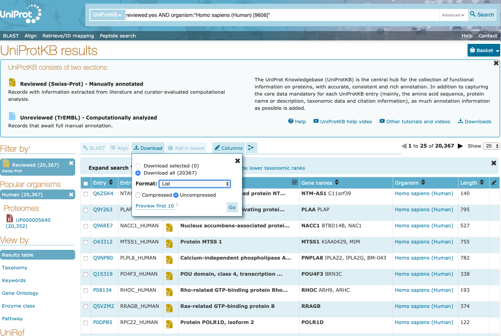

# KEGG Database Pathway Parser

This parser converts [KEGG KGML files](https://www.kegg.jp/kegg/xml/docs/) into two versions of pathways: one that retains family and complex information, and one that "expands" the protein families and complexes into individual proteins.  It was heavily adapted from the parser developed in TM Murali's group at Virginia Tech, which was authored by myself, Allison Tegge, and Richard Rodrigues at Virginia Tech (around 2013 or so).

This parser is written in Python3 using the [BioPython module](https://biopython.org/) for accessing and traversing [KEGG KGML objects](https://www.kegg.jp/kegg/xml/docs/) through [KEGG's REST API](https://www.kegg.jp/kegg/rest/keggapi.html).  We currently use it to convert KEGG pathways into UniProtKB identifiers; entities that are not mapped to the appropriate namespace are ignored.  Note that the edges here are not necessarily represented in the large interactomes that our group uses, since the most recent parsing might have introduced new interactions that are not part of the original [PathLinker](https://github.com/Murali-group/PathLinker) interactomes.  An example of a recently developed interactome is included in the [Localized PathLinker (LocPL)](https://github.com/annaritz/localized-pathlinker) repository.

The main function is located within `parse_kegg.py`. Running `python3 parse_kegg.py -h` will print usage information:

```
usage: KEGG Pathway Processor. At least one of --list, --graph, or --graph_single must be specified.
       [-h] [--list] [--graph] [--graph_single GRAPH_SINGLE] [-s SPECIES]
       [-c CONVERT] [-f FILTER] [-o OUTDIR]

optional arguments:
  -h, --help            show this help message and exit
  --list                list pathways to stdout.
  --graph               make graph for all pathways from the specified
                        species.
  --graph_single GRAPH_SINGLE
                        make graph of a single pathway. Pass in the pathway
                        identifier (e.g. hsa04310).
  -s SPECIES, --species SPECIES
                        species/taxon identifier. Default is hsa.
  -c CONVERT, --convert CONVERT
                        convert kegg id to this case insensitive id/namespace
                        (ncbi-geneid | ncbi-proteinid | uniprot). Default is
                        uniprot
  -f FILTER, --filter FILTER
                        filter converted IDs by single-column file of ids.
                        Only IDs that appear in this file will be used.
  -o OUTDIR, --outdir OUTDIR
                        outfile directory.
```

## Requirements
* Python3 (developed and tested with `python 3.5.1`)
* BioPython (developed and tested with `biopython==1.76`)

## Options and Output Files

There are three main functions of this script: (a) list all files (`--list`), (b) parse a single pathway (`--graph_single`), and (c) parse all pathways for a species (`--graph`).  If one or more pathways are parsed, files are placed in an output directory specified with `-o` or `--outdir`. If no directory exists, then one is automatically created.

* `pathway.kgml`: KGML file from KEGG.  If this file exists, the program reads from the file instead of queries KEGG through the REST API.
* `pathway-gene-entries.txt`: tab-delimited file of gene entries in the pathway.
* `pathway-gene-groups.txt`: tab-delimited file of gene groups (complexes) in the pathway.
* `pathway-gene-relations.txt`: tab-delimited file of entity relations (interactions) in the pathway.
* `pathway-collapsed-edges.txt`: graph with "collapsed" edges.
* `pathway-expanded-edges.txt`: graph with "expanded" edges.

See Parsing Details for more information about the intermediate and final output files.

## Quick Start

### Listing KEGG Pathways

List all human pathways:
```
python3 parse_kegg.py --list
```

List all yeast pathways:
```
python3 parse_kegg.py --list -s sce
```
### Parse a single KEGG Pathway

Parse the human Wnt signaling pathway, converted to UniProtKB IDs (default). Store files in `output/` directory:
```
python3 parse_kegg.py --graph_single hsa04310 -o output/
```

Parse the human Wnt signaling pathway with reviewed UniProtKB IDs (passed as a filter file).  See the Filter File section below for more details.
```
python3 parse_kegg.py --graph_single hsa04310 -o output/ -f uniprot-swissprot-ids.txt
```

Parse the human Wnt signaling pathway with NCBI gene IDs. *TODO:* This is a little buggy.
```
python3 parse_kegg.py --graph_single hsa04310 -o output -c ncbi-geneid
``` 

### Parse all KEGG Pathways
Parse all human signaling pathways, converted to UniProtKB IDs (default). Store files in `output/` directory:
```
python3 parse_kegg.py --graph -o output/
```

Parse all yeast signaling pathways, converted to UniProtKB IDs (default). Store files in `output/` directory:
```
python3 parse_kegg.py --graph -s cse -o output/
```

## Parsing Details

TODO fill in.

## Filter File

I downloaded the filter file of UniProtKB reviewed proteins (SwissProt) from the [UniProt Database website](https://www.uniprot.org/).  


The filter file passed with the `-f` or `--filter` option is a single-column file that contains all *allowed* namespace identifiers.  Passing this filter file in will require that all UniProtKB identifiers are reviewed.

